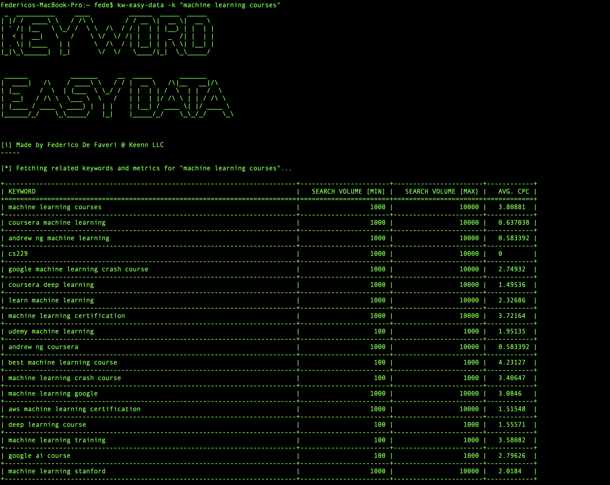
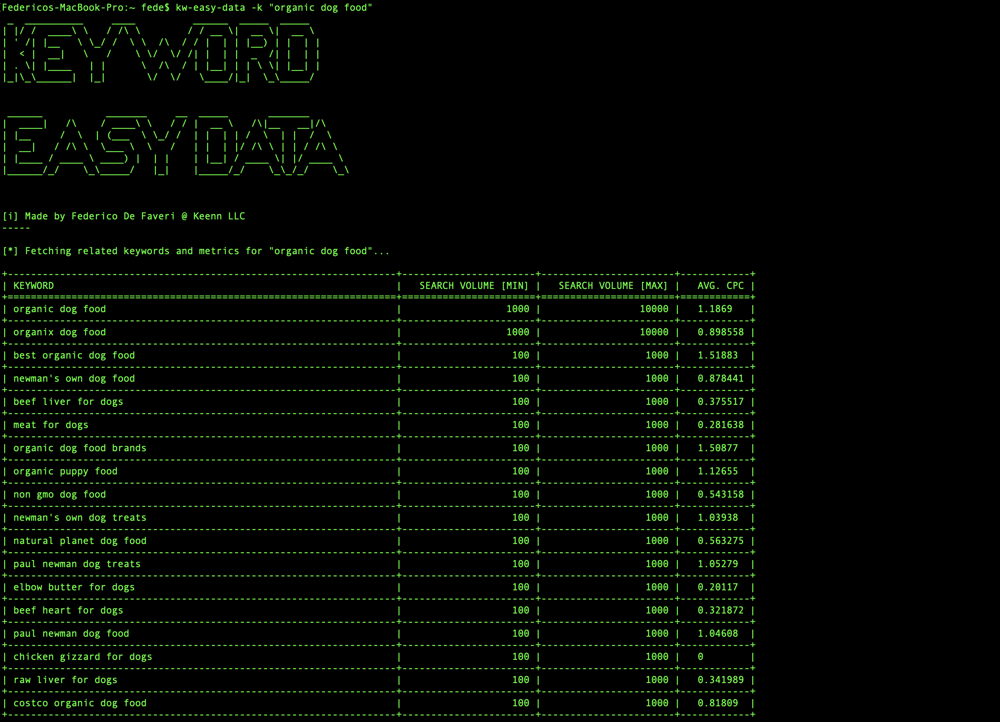

# Easy Keyword Data Tool by Keenn

## Installation

By installing I mean making sure we can run this script from everywhere in the terminal.

1. `cd` into the root folder.

2. At the unix command prompt, type the following to make `kw-easy-data.py` executable:

`$ chmod +x kw-easy-data.py`

2. Move `kw-easy-data.py` into your preferred bin directory, or create a symlink to it with `ln -s $PWD/kw-easy-data.py /usr/local/bin/kw-easy-data`.

That's it now the script will be runnable from anywhere with the command `kw-easy-data`.

## How it works

To display the help info anytime execute `kw-easy-data -h`

## Screenshots

